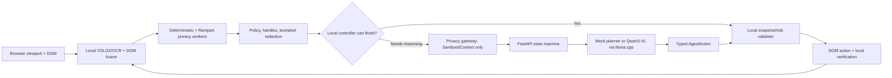

# ContextShield

> **New to the project?** Use the one-command guide:
> [START-HERE.md](START-HERE.md). In short, load the stable release once and run
> double-click `START.command` (or run `./START.sh`) whenever you want to use the product.
> Presenting to judges? Follow the three-minute, single-page script in
> [judge-demo.md](docs/judge-demo.md).

ContextShield is a privacy-preserving autonomous browser agent for SIH 2026,
Problem Statement 26171. The browser observes the page, detects and transforms
sensitive data locally, sends only a strict `SanitizedContext` to a local
planner, validates its typed action, executes locally, verifies, and repeats.

## Architecture



There is no network API that accepts a raw DOM, `PageObservation`, screenshot,
password, OTP, cookie, or vault value. Known local secrets are searched again at
the only outbound gateway. Privacy/model errors block transmission; they never
select a raw fallback.

## What is implemented

- Chrome and Firefox MV3 builds using WXT, React, and strict TypeScript.
- Stable element-ID semantic perception, private form-value separation, visual
  candidates, state fingerprints, stale-state rejection, selected-option state,
  checkbox/radio labels and semantic values, page-order grounding, full viewport
  OCR/face analysis, and bounding-box fusion with DOM records.
- Indian-format deterministic detectors and checksum validation, the Rampart
  contextual ONNX model in a Web Worker (WebGPU with WASM fallback), generic
  packaged YOLOX face and PP-OCRv6-tiny ONNX workers, a live offscreen
  screenshot/crop pipeline, and verified irreversible raster masking.
- Policy decisions, a memory-only local secret vault, safe context construction,
  a no-bypass network gateway, and actual server-view preview.
- FastAPI/Pydantic API, SQLite sanitized traces, strict agent state transitions,
  deterministic mock planner, and Qwen3-VL adapter through llama.cpp's local
  OpenAI-compatible endpoint.
- A DOM action broker for click, local-handle typing, selection, and scrolling;
  origin/snapshot/element/option checks; high-risk confirmation; local verify and
  re-observe loop.
- A backend-optional local controller for exact form/control tasks, screen
  summaries, named navigation buttons and scrolling. Complex comparison and
  judgment tasks alone cross the strict sanitized gateway to Qwen.
- Product popup, controlled demos, unit/integration/browser tests, and a measured
  deterministic PII benchmark.
- Local-service health in the popup, typed ASK_USER replies that are sanitized
  before replanning, injected-extension UI filtering, and persistent macOS
  services managed by the per-user service manager.
- Structured task values for first name, last name, email, phone, address, and
  UPI are converted into memory-only `LOCAL_*` handles before transmission.
  React/Bootstrap row labels are combined with field placeholders so sibling
  controls remain distinguishable without website-specific selectors.

See [target-status.md](docs/target-status.md) for production benchmarking and
human/fresh-machine validation still outside this executable prototype.

For a command-by-command explanation aimed at first-time setup, including what
Rampart, Qwen, YOLOX, and PP-OCR each do, read
[full-setup.md](docs/full-setup.md).

## Prerequisites

- Node.js 22+ and npm 11+
- Python 3.11–3.14
- Chrome/Chromium or Firefox 140+
- About 100 MB for the unpacked Chrome release (the ZIP is about 38 MB),
  plus project dependencies and the larger Firefox fallback build
- About 15 MB of packaged Rampart artifacts; setup verifies their pinned
  SHA-256 values and the extension never downloads them at runtime
- Optional Qwen mode: current `llama-server`, about 3–5 GB free disk and enough
  RAM/VRAM for a 4B Q4 model plus its vision projector

## Install

```bash
cd contextshield
./scripts/setup.sh
```

The script installs pinned npm/Python dependencies, prepares WXT, and installs
Playwright Chromium. It does not install llama.cpp or multi-gigabyte Qwen weights.

## Run the complete local product

Use one command from the repository root:

```bash
./START.sh
```

On macOS, the simplest equivalent is to double-click `START.command`.

It creates the stable extension release if missing and starts local Qwen, the
backend, and demo site. Later starts never rebuild the installed extension. The
first run downloads Qwen once. Use `./START.sh --mock` only when you explicitly
want the predictable test planner.
After startup reports ready, Terminal can be closed: Qwen, the backend, and the
demo remain running until `STOP.command` or `./STOP.sh` is used.

Then load one build:

- Chrome: open `chrome://extensions`, enable Developer mode, choose **Load
  unpacked**, and select `release/ContextShield-Chrome`.
- Firefox: open `about:debugging#/runtime/this-firefox`, choose **Load Temporary
  Add-on**, and select `release/ContextShield-Firefox/manifest.json`.

Open [http://127.0.0.1:4173](http://127.0.0.1:4173). The judge control room shows
live planner readiness, the six-minute presentation route, measured evidence and
safe public-site tests. Choose a demo, open the extension, optionally add an Email
to the memory-only vault, enter the suggested task, and select **Start agent**.
Rampart, YOLOX and PP-OCR are already packaged
inside the release and never download model files at runtime. If any local model
cannot load, the popup fails closed before any page context is sent.

The judge control room is a React 19 and Tailwind CSS 4 application in
[`judge-site`](judge-site). `START.command` builds it automatically. For visual
development only, run `npm run dev:judge`; the production stack remains the
single-command `START.command` workflow.

The backend health check is:

```bash
curl http://127.0.0.1:8000/health
```

Expected in the normal mode:

```json
{"status":"ok","service":"contextshield-agent","model_backend":"llama","planner_ready":true,"privacy_boundary":"sanitized-context-only"}
```

For a plain-English readiness report, run:

```bash
./scripts/doctor.sh
```

## Run with Qwen3-VL-4B and llama.cpp

Install a current llama.cpp release that provides `llama-server`, then run:

```bash
./scripts/start-llama.sh
```

The script asks llama.cpp to fetch the official
`Qwen/Qwen3-VL-4B-Instruct-GGUF:Q4_K_M` repository and its multimodal projector,
then serves it only on `127.0.0.1:8080`. In a second terminal:

```bash
MODEL_BACKEND=llama ./scripts/start-server.sh
```

No paid API key is used. The first model download is roughly 2.5 GB plus the
projector. `MODEL_BACKEND=mock` is the fast deterministic demo and test mode;
`MODEL_BACKEND=llama` is the real VLM path.

For reviewed offline artifacts, use the checksum-enforcing downloader:

```bash
CONTEXTSHIELD_MODEL_MANIFEST=/absolute/path/reviewed-manifest.json \
  ./scripts/download-models.sh
```

The manifest format and provenance requirements are in
[models/README.md](models/README.md).

## Tests and quality gates

```bash
npm run lint
npm test
npm run build
npm run build:firefox
npm run test:e2e
.venv/bin/ruff check server
.venv/bin/pytest server/tests
```

Or run the complete gate:

```bash
./scripts/check.sh
```

The Playwright test loads the real Chrome MV3 extension, uses a controlled page
and mock agent API, resolves `LOCAL_EMAIL_1` locally, completes the multi-step
loop, and asserts that the raw email is absent from every captured API payload.

## Benchmarks

```bash
./scripts/run-benchmarks.sh
```

The command runs regression tests, a 295-case synthetic PII corpus, 100 pixel
redaction cases, and a 61-screen controlled perception corpus, then writes real
calculated output to `benchmarks/results/latest.json`. When the full stack is
running it also records real Qwen task completion and stage-by-stage client
latency. The report labels independently reviewed YOLOX accuracy unavailable;
it does not fabricate that score.

For the expanded real-model audit, first start the stack with `START.command`,
then run **`npm run audit:fresh`**. It packages the extension, runs eleven authored
privacy pages through DOM + YOLOX + OCR + Rampart, checks actual redacted pixels,
measures a paired Chromium baseline, and repeats the real Qwen judge task three
times. Failed attempts stay in the results. Set `CONTEXTSHIELD_E2E_EXTERNAL=1`
to include the five public practice-site scenarios. External tests use fake data.

Reports are in `benchmarks/results/`. Full-model regression classifications are
not equivalent to independently reviewed entity/span precision and recall.
Local-only and server-assisted task timings are reported separately. Browser
process RSS is not extension-only memory, and GPU-process RSS is not VRAM.
Read the [fresh audit results and remaining limits](docs/FRESH-AUDIT-RESULTS.md).

The v1.4.0 judge-extension changes and real-model verification are recorded in
[SIH-RELEASE-v1.4.0.md](docs/SIH-RELEASE-v1.4.0.md).

The measured v1.2.0 acceptance summary is in
[SIH-ACCEPTANCE-v1.2.0.md](docs/SIH-ACCEPTANCE-v1.2.0.md). The fresh v1.3.0
build, test and public-Selenium verification is recorded in
[SIH-RELEASE-v1.3.0.md](docs/SIH-RELEASE-v1.3.0.md).

## Demo procedure

**For the three-minute pitch:** open <http://127.0.0.1:4173/judge-run.html> in
Chrome, open ContextShield v1.4.0, click **Use demo task**, then **Start agent**.
Keep that page active. After the test ticket is prepared, click **Show the
privacy proof**. It shows the actual redacted image, hidden-item groups and
server delivery status without making judges read JSON. See
[the timed script](docs/judge-demo.md) for exact narration and limitations.

The following are optional Q&A examples:

1. Privacy proof: use `privacy-proof.html`, run a task, expand **Actual server
   view**, and inspect the `/v1/agent/*` request in DevTools. The synthetic email,
   phone, password, UPI ID, and fictional portrait pixels must be absent.
2. Autonomous agent: use `checkout.html` and ask it to choose the cheapest
   morning fare and continue. The timeline shows every observe/sanitize/plan/
   execute/verify transition.
3. Local secret: add a synthetic email to the popup vault, run checkout, and
   show `LOCAL_EMAIL_1` in the request while the actual email appears only in the
   local form.
4. Fail closed: use `fail-closed.html` with `Click Arm stale-state mutation,
   then click Continue to finish task.`, or stop Rampart/model inference. A stale action terminates immediately
   with a specific safe error instead of consuming the global step limit.
5. General controls: use `general-controls.html` and ask it to select Python from
   the first dropdown, Option 2, and Blue. The controlled regression checks all
   three final states.
6. Public Selenium form: open
   `https://www.selenium.dev/selenium/web/web-form.html` and use the exact prompt
   in [judge-demo.md](docs/judge-demo.md). The opt-in external test checks the
   generic text value, selected option, checkbox state and unchanged URL.
7. Public ordinal checkboxes: open
   `https://the-internet.herokuapp.com/checkboxes` and ask `Select the first
   checkbox and clear the second checkbox.` The release test checks both final
   DOM states and rejects a blocked planner response as an unsuccessful task.

The maintained judge narration, public URLs and exact prompts are in
[judge-demo.md](docs/judge-demo.md). [demo-scenarios.md](docs/demo-scenarios.md)
contains the shorter engineering scenario notes.

## Docker

The mock backend can also run with:

```bash
docker compose up --build agent-server
```

Qwen remains an optional separately managed local llama.cpp process; this keeps
the default container small and GPU-independent.

## Known limitations

- The production extension requests `<all_urls>` so explicitly started tasks
  can run on arbitrary HTTP/HTTPS sites and survive normal navigation. Chrome
  blocks every extension from `chrome://` pages, the Chrome Web Store, closed
  Shadow DOM, browser-owned PDF UI, and some inaccessible cross-origin frames.
- The packaged YOLOX checkpoint detects faces only. Critical document regions
  are conservatively classified from PP-OCR text matches; a representative
  labelled visual benchmark and a dedicated document detector remain required
  before production claims.
- Rampart's documented language/model limitations still apply. Its npm runtime
  is pinned, but browser-fetched weights should be mirrored with reviewed hashes
  before a final offline competition build.
- The Qwen adapter and grounding tests are automated, but real-model quality and
  latency depend on the judge machine and must be benchmarked after the 2.5+ GB
  weights are installed.
- The current unpacked release is about 100 MB and includes roughly 25 MB of
  privacy-model assets plus browser inference runtimes.
- Firefox builds pass; store signing/manual Firefox UI verification is external.
- A second teammate must still perform the clean-machine reproduction. GitHub
  remote setup, branch protections, review, release tag, and browser-store
  publication require the repository owner's accounts.
- Current Transformers.js transitive packages produce high-severity npm audit
  advisories in Node-only `sharp`/`onnxruntime-node` paths even though the browser
  bundle uses web backends; upstream currently exposes no audit fix. Review this
  before release rather than suppressing it.

## Repository structure

```text
contextshield/
├── extension/             WXT browser product, local workers and tests
├── server/                FastAPI planner, model adapter and SQLite traces
├── shared/                matching Zod contracts and fixtures
├── demo/                  controlled SIH demonstration pages
├── benchmarks/            measured benchmark runner and datasets/results
├── scripts/               setup, launch, download, smoke and quality gates
├── docs/                  architecture, contracts, privacy, threats, status
├── models/                ignored reviewed local model artifacts
├── .github/workflows/     CI for browser and server paths
└── docker-compose.yml
```
